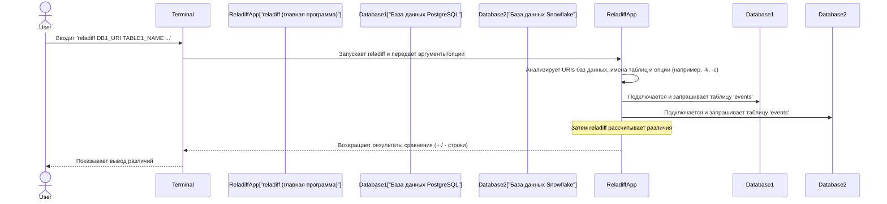

# Глава 1: Интерфейс командной строки (CLI)

Добро пожаловать в мир `reladiff`! В этой первой главе мы рассмотрим основной способ взаимодействия с `reladiff`: через его интерфейс командной строки, или CLI. Представьте CLI как вашу главную "панель управления" или "универсальный пульт" для сравнения данных в разных базах данных.

## Что такое интерфейс командной строки (CLI)?

Представьте, что вы хотите сказать своему компьютеру что-то сделать. Вы можете щёлкать по иконкам, открывать программы и использовать меню, верно? Обычно именно так работают графические программы. **Интерфейс командной строки (CLI)** — это другое дело. Вместо кликов вы вводите команды прямо в специальное окно под названием "терминал" или "командная строка".

Для `reladiff` CLI очень мощный, потому что он позволяет:
* Быстро выполнять операции сравнения без необходимости писать код.
* Интегрировать `reladiff` в автоматизированные скрипты (например, ежедневные проверки или развертывания), делая его ключевым инструментом для DevOps и специалистов по данным.
* Точно указывать, что именно и как сравнивать.

## Наше первое задание: сравнение двух таблиц

Представьте, у вас есть таблица с названием `events` в вашей базе данных PostgreSQL и другая таблица с тем же названием `events` в базе данных Snowflake. Ваша задача — выяснить, есть ли различия между этими двумя таблицами. Это обычная задача при миграции данных, проверке целостности данных или валидации развертываний.

С помощью CLI `reladiff` решение этого задания очень простое. Вы передаете `reladiff` информацию вроде:
1. Где находится первая таблица (адрес базы данных PostgreSQL и название таблицы).
2. Где находится вторая таблица (адрес базы данных Snowflake и название таблицы).
3. Любые дополнительные инструкции, например, по каким столбцам выполнять сравнение.

Вот базовый шаблон для запуска `reladiff` для сравнения таблиц в разных базах данных:

```bash
reladiff  DB1_URI  TABLE1_NAME  DB2_URI  TABLE2_NAME  [OPTIONS]
```

А если обе таблицы находятся в *одной* базе данных, можно использовать чуть более короткую команду:

```bash
reladiff  DB_URI  TABLE1_NAME  TABLE2_NAME  [OPTIONS]
```

Пока не беспокойтесь о `[OPTIONS]`; об этом мы поговорим чуть позже!

## Реальный пример

Рассмотрим пример из файла `README.md` проекта `reladiff`, чтобы увидеть CLI в действии: сравнение таблицы `events` между PostgreSQL и Snowflake.

```bash
reladiff \
  postgresql:/// \
  events \
  "snowflake://<имя_пользователя>:<пароль>@<хост>/<БД>/<СХЕМА>?warehouse=<СКЛАД>&role=<РОЛЬ>" \
  events \
  -k event_id \         # Это "опция"
  -c event_data \       # Еще одна опция
  -w "event_time < '2024-10-10'"    # Еще одна опция
```

Когда вы введете это в терминал и нажмете Enter, `reladiff` запустится!

Разберем, что означает каждая часть этой команды:

* **`reladiff`**: команда для запуска программы `reladiff`.
* **`postgresql:///`**: это "URI базы данных" для вашей первой базы (PostgreSQL). Можно представить его как адрес, по которому `reladiff` подключается. `///` обычно означает подключение к локальной базе PostgreSQL с настройками по умолчанию.
* **`events`**: название первой таблицы, которую нужно сравнить в PostgreSQL.
* **`"snowflake://<имя_пользователя>:<пароль>@<хост>/..."`**: это "URI базы данных" для второй базы (Snowflake). Он более сложный, потому что для соединения со Snowflake нужны дополнительные параметры, такие как имя пользователя, пароль, хост и конкретные названия базы данных/схемы. **Важно:** всегда заключайте URIs в кавычки, особенно если они содержат специальные символы, чтобы избежать ошибок в командной строке.
* **`events`**: название второй таблицы для сравнения в Snowflake.
* **`-k event_id`**: это **опция**. `-k` — сокращение от `--key-columns`. Она говорит `reladiff`, что `event_id` — это основной столбец, который `reladiff` должен использовать для уникальной идентификации строк в обеих таблицах. Это важно для правильного сравнения строк!
* **`-c event_data`**: еще одна опция, сокращение от `--columns`. Она сообщает `reladiff`, что нужно также сравнить столбец `event_data` в обеих таблицах. Можно использовать `-c` несколько раз для сравнения дополнительных столбцов.
* **`-w "event_time < '2024-10-10'"`**: эта опция, сокращение от `--where`, добавляет фильтр. Она говорит `reladiff`, что нужно сравнивать только те строки, у которых значение в столбце `event_time` старше `'2024-10-10'`. Это очень удобно для сравнения только определенной части данных.

После запуска команда `reladiff` выведет все найденные различия прямо в терминал. Например, если строка есть в PostgreSQL, но отсутствует в Snowflake, или наоборот, или если значения в конкретных столбцах (`event_data` в нашем примере) отличаются для одной и той же `event_id`, вы увидите это! Вывод может выглядеть так (упрощенно):

```
+ (123, 'some_new_data')  # Строка добавлена в правую таблицу
- (456, 'old_data')       # Строка удалена из левой таблицы
```

## Как `reladiff` понимает ваши команды (изнутри)

Когда вы вводите команду `reladiff` с аргументами и опциями, за кулисами происходит много процессов, чтобы `reladiff` понял ваш запрос. Посмотрим на упрощенную последовательность событий:



По сути, `reladiff` использует библиотеку Python под названием `Click`, которая облегчает создание командных интерфейсов. `Click` помогает `reladiff` определить, какие аргументы (например, `DB_URI`) и опции (например, `-k`) он ожидает.

Давайте взглянем на очень упрощенный пример из основного файла программы `reladiff` (`reladiff/__main__.py`), чтобы понять, как определяются эти аргументы и опции:

```python
# Из reladiff/__main__.py

import click # Библиотека для построения CLI

@click.command(no_args_is_help=True) # Указывает, что это команда
@click.argument("database1", required=False) # Определяет первый URI базы данных как аргумент
@click.argument("table1", required=False)    # Определяет название первой таблицы
@click.argument("database2", required=False) # Определяет второй URI базы данных
@click.argument("table2", required=False)    # Определяет название второй таблицы
@click.option(
    "-k", "--key-columns", default=[], multiple=True, help="Имена ключевых столбцов."
) # Определяет опцию -k
@click.option("-c", "--columns", default=[], multiple=True, help="Имена дополнительных столбцов для сравнения.")
# ... здесь определяются еще многие опции ...
def main(database1, table1, database2, table2, key_columns, columns, **kw):
    # Здесь начинается обработка вашей команды
    # database1, table1 и т.д. — переменные Python, содержащие введенные вами данные!
    # ...
    pass # Здесь очень сложная логика!
```

В этом коде `@click.argument(...)` и `@click.option(...)` — специальные маркеры (так называемые "декораторы"), которые сообщают `Click`, как разобрать введенную команду. Например, `click.argument("database1", ...)` говорит `Click`, что после `reladiff` он ожидает первую часть информации (если она не является опцией), которая называется `database1`. Аналогично, `click.option("-k", ...)` говорит, что если вы введете `-k` или `--key-columns`, то следующий фрагмент — это для `key_columns`.

Когда `Click` обработает вашу команду, он вызовет функцию `main` (или `_main` внутри `reladiff` по внутренним причинам) и передаст ей все разобранные данные как обычные переменные Python. Поэтому `database1`, `table1`, `key_columns` и `columns` появляются как входные параметры функции `main`.

Позже в `_main` функции `reladiff` использует эти переменные для выполнения своих основных задач. Например, она использует `database1` и `threads` (еще одну опцию для повышения производительности), чтобы подключиться к вашей первой базе данных:

```python
# Из reladiff/__main__.py, внутри функции _main

from .databases import connect # Функция для подключения к базе данных

# ...
    db1 = connect(database1, threads1 or threads) # Подключается к первой базе
    if database1 == database2:
        db2 = db1 # Если базы одинаковые, используют одно соединение
    else:
        db2 = connect(database2, threads2 or threads) # Подключается ко второй базе
# ...
```

Затем, после подключения, `reladiff` использует названия таблиц, ключевые столбцы и другие опции для настройки процесса сравнения:

```python
# Из reladiff/__main__.py, внутри функции _main

from .table_segment import TableSegment # Представляет таблицу или ее часть
from .hashdiff_tables import HashDiffer # Один из алгоритмов сравнения

# ...
    # Выбирает подходящий алгоритм сравнения, в зависимости от одинаковости баз данных
    differ = HashDiffer(...) # Или JoinDiffer, если таблицы в одной базе

    # Готовит информацию о таблицах (сегменты) для сравнения
    segments = [
        TableSegment(db, table_path, key_columns, update_column, columns, **options)
        for db, table_path, raw_schema in safezip(dbs, table_paths, schemas)
    ]

    diff_iter = differ.diff_tables(*segments) # Запускает процесс сравнения!
# ...
```

Это общий обзор, но он показывает, что все, что вы вводите в CLI, становится переменной, которую `reladiff` использует внутри для выполнения своих сложных сравнений баз данных.

## Заключение

Вы только что узнали о интерфейсе командной строки (CLI), который является вашим основным способом взаимодействия с `reladiff`. Теперь вы понимаете, как строить основные команды `reladiff`, что такое аргументы и опции, и как они помогают вам задавать соединения с базами данных, имена таблиц и критерии сравнения. Также вы заглянули внутрь того, как `reladiff` обрабатывает эти команды для начала процесса сравнения.

В следующей главе мы познакомимся с [системой конфигурации](02_configuration_system_.md), которая предоставляет альтернативный, зачастую более удобный способ управлять настройками `reladiff`, особенно при частом использовании или сложных операциях сравнения.
