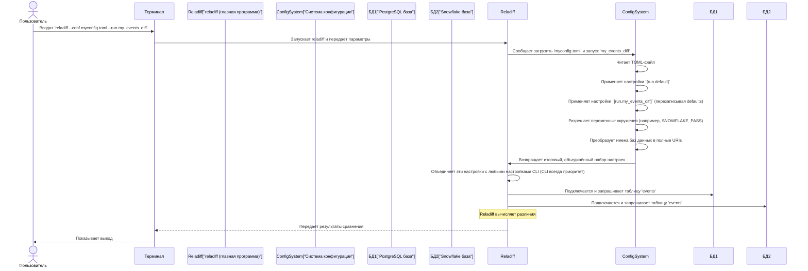

# Глава 2: Система конфигурации

С возвращением, искатели приключений `reladiff`! В [Глава 1: Интерфейс командной строки (CLI)](01_command_line_interface__cli__.md) вы научились управлять `reladiff` прямо из терминала. Вы узнали, как указывать подключения к базам данных, имена таблиц и различные параметры с помощью длинных команд.

Но что если у вас есть любимое сравнение, которое вы запускаете каждый день? Или что если детали соединения с базой данных очень длинные и содержат конфиденциальную информацию, такую как пароли? Повторное ввод этих данных может быть утомительным, подверженным ошибкам и даже опасным, если вы вставляете пароли прямо в историю команд вашего терминала.

Вот тут на помощь приходит **Система конфигурации** `reladiff`!

## Что такое система конфигурации?

Думайте о системе конфигурации как о вашем личном **"книге рецептов"** для запусков `reladiff`. Вместо того чтобы каждый раз передавать `reladiff` все необходимые компоненты (URIs баз данных, имена таблиц, параметры), вы можете записать их один раз в специальном файле. Этот файл затем становится многоразовым рецептом.

Почему это так удобно:

*   **Лёгкое повторное использование:** Определите общие сравнения один раз и запускайте их по короткому имени.
*   **Читаемость:** Держите сложные настройки аккуратно организованными в файле, делая конфигурацию `reladiff` более ясной.
*   **Безопасность:** Более безопасно храните конфиденциальные данные (например, пароли), ссылаясь на них через переменные окружения, а не жестко прописывая в файлах или вводя их вручную в командной строке.

`reladiff` использует простую файловую структуру под названием **TOML** для своей конфигурации. Файлы TOML легко читаются человеком и парсятся компьютером, немного напоминают упрощённую версию JSON или INI.

## Ваша первая рецептура: файл `reladiff.toml`

Давайте снова возьмём нашу задачу из Глава 1: сравнить таблицы `events` в PostgreSQL и Snowflake.

Вместо этой длинной команды:

```bash
reladiff \
  postgresql:/// \
  events \
  "snowflake://<username>:<password>@<host>/<DATABASE>/<SCHEMA>?warehouse=<WAREHOUSE>&role=<ROLE>" \
  events \
  -k event_id \
  -c event_data \
  -w "event_time < '2024-10-10'"
```

мы можем создать файл `reladiff.toml`.

**Шаг 1: Определите ваши базы данных**

Сперва, сохраним детали подключения к базам данных. В файле `reladiff.toml` вы используете секцию `[database.<имя>]`. Это позволяет дать дружелюбное имя вашему подключению к базе.

Создайте файл с именем `reladiff.toml` (или любым другим `.toml`) и добавьте туда:

```toml
# reladiff.toml

# Раздел для определения баз данных
[database.my_local_pg]
driver = "postgresql"  # Указывает reladiff, что это PostgreSQL
uri = "postgresql:///" # Строка подключения (URI)

[database.my_snowflake]
driver = "snowflake"
# Используем переменную окружения для пароля, безопаснее!
uri = "snowflake://${SNOWFLAKE_USER}:${SNOWFLAKE_PASS}@${SNOWFLAKE_HOST}/${SNOWFLAKE_DB}/${SNOWFLAKE_SCHEMA}?warehouse=${SNOWFLAKE_WAREHOUSE}&role=${SNOWFLAKE_ROLE}"
```

**Что здесь происходит?**

*   Созданы две именованные конфигурации баз данных: `my_local_pg` и `my_snowflake`.
*   Для `my_local_pg` задаются `driver` и `uri`.
*   Для `my_snowflake` используются переменные `${SNOWFLAKE_USER}` и т. д. — это особенность `reladiff`. Она означает, что `reladiff` будет искать переменные окружения с такими именами (например, `SNOWFLAKE_USER`) на вашем компьютере и автоматически вставлять их значения. Это гораздо безопаснее, чем вводить пароли вручную или хранить их в файле.

Перед запуском установите эти переменные окружения в вашем терминале (замените плейсхолдеры на свои реальные данные):

```bash
export SNOWFLAKE_USER="ваш_пользователь"
export SNOWFLAKE_PASS="ваш_пароль"
export SNOWFLAKE_HOST="хост.snowflakecomputing.com"
export SNOWFLAKE_DB="ВАША_БД"
export SNOWFLAKE_SCHEMA="ВАША_СХЕМА"
export SNOWFLAKE_WAREHOUSE="ВАШЕ_ХРАНИЛИЩЕ"
export SNOWFLAKE_ROLE="ВАША_РОЛЬ"
```
(Пример для Linux/macOS. На Windows используйте `set SNOWFLAKE_USER=...` в командной строке или `$env:SNOWFLAKE_USER="..."` в PowerShell.)

**Шаг 2: Определите запуск сравнения**

Теперь, когда ваши базы данных определены, создадим конкретный запуск сравнения. Для этого используйте секцию `[run.<имя>]`.

Добавьте это в ваш `reladiff.toml`:

```toml
# reladiff.toml (продолжение)

# Раздел для определения "запуска" сравнения
[run.default]
# Эти настройки применяются ко всем запускам по умолчанию, если не переопределены
verbose = true # Всегда выводить дополнительную информацию

[run.compare_events]
# Этот запуск сравнивает таблицы 'events'
# Источник 1 (левая сторона сравнения)
1.database = "my_local_pg"  # Ссылаемся на ранее определённую базу
1.table = "events"

# Источник 2 (правая сторона сравнения)
2.database = "my_snowflake" # Ссылаемся на другую базу
2.table = "events"

# Общие параметры для этого сравнения
key-columns = ["event_id"]  # Использовать event_id как уникальный ключ
columns = ["event_data"]    # Также сравнить колонку event_data
where = "event_time < '2024-10-10'" # Только старые события
```

**Что здесь происходит?**

*   `[run.default]` — специальная секция, где задаются параметры по умолчанию для всех запусков. Например, `verbose = true` — всегда показывать расширенную информацию, если не указано иное.
*   `[run.compare_events]` — название конкретного рецепта сравнения.
*   `1.database` и `2.database` — указывают, какие именованные базы данных (из секции `[database]`) использовать для первой и второй таблиц.
*   `1.table` и `2.table` — имена таблиц внутри этих баз.
*   Также заданы `key-columns`, `columns` и `where`, такие же, как в CLI. Обратите внимание, что `key-columns` — список, он может содержать несколько элементов.

## Запуск вашего конфигурационного сравнения

Теперь, когда файл `reladiff.toml` готов, запуск сравнения очень прост:

```bash
reladiff --conf reladiff.toml --run compare_events
```

И `reladiff` выполнит то же самое сравнение, что и длинная команда из Глава 1!

**Почему это лучше?**

*   Команда короче и проще запомнить.
*   Все сложные детали хранятся в одном читаемом файле.
*   Ваш конфиденциальный пароль Snowflake никогда не попадёт прямо в историю команд!

### Переопределение настроек

Система конфигурации `reladiff` задаёт порядок приоритетов для настроек, чем-то напоминая правила:

1.  **Опции CLI (самый высокий приоритет):** все параметры, которые вы вводите прямо в командной строке (например, `-v` или `-k`).
2.  **Настройки именованного запуска:** параметры, заданные в секции `[run.<имя>]` (например, `[run.compare_events]`).
3.  **Настройки по умолчанию для запуска:** из секции `[run.default]`.
4.  **Определения баз данных:** URIs, заданные в `[database.<имя>]`.

Это значит, что вы всегда можете подкорректировать запуск прямо из командной строки. Например, если `compare_events` установил `verbose = false`, но вы хотите видеть расширенный вывод для *этого конкретного запуска*, сделайте так:

```bash
reladiff --conf reladiff.toml --run compare_events -v
```

Опция `-v` из CLI переопределит `verbose = false` в этом запуске.

## Как `reladiff` понимает ваши рецепты (под капотом)

Когда вы запускаете `reladiff` с опциями `--conf` и `--run`, происходит примерно следующее:



По сути, программа `reladiff` использует специальную функцию `apply_config_from_file` (находится в `reladiff/config.py`), которая занимается загрузкой и объединением конфигурации.

Посмотрим, как она вызывается в `reladiff/__main__.py`:

```python
# Из reladiff/__main__.py

# ...
from .config import apply_config_from_file # Импорт функции

@click.command(no_args_is_help=True)
# ... Определение CLI-аргументов и опций ...
@click.option(
    "--conf",
    default=None,
    help="Путь к файлу конфигурации (например, config.toml)...",
    metavar="ПУТЬ",
)
@click.option(
    "--run",
    default=None,
    help="Имя конфигурации запуска...",
    metavar="ИМЯ",
)
def main(conf, run, **kw): # kw — все остальные CLI-опции
    # ...
    if conf:
        # Тут происходит магия!
        kw = apply_config_from_file(conf, run, kw)
    # ...
    try:
        return _main(**kw) # _main получает объединённые настройки
    except Exception as e:
        # ...
        pass
```
Функция `main` (её вызывает `Click` при запуске `reladiff`) проверяет, указали ли вы `--conf`. Если да, то вызывает `apply_config_from_file`. Важный момент: она передаёт `kw` (всё, что вы ввели в CLI) в `apply_config_from_file`. Это нужно для того, чтобы система конфигурации знала, какие параметры вы указали вручную, и могла их приоритетно учитывать.

В `reladiff/config.py` функция `_apply_config` занимается основной работой — чтением TOML-файла, разрешением переменных окружения и объединением всех настроек:

```python
# Из reladiff/config.py (упрощённо)

import re
import os
import toml

def _apply_config(config: dict, run_name: str, kw: dict):
    # 1. Разрешение переменных окружения вида ${ENV_VAR}
    _resolve_env(config)

    # 2. Извлечение определений баз данных и запусков из файла
    databases = config.pop("database", {})
    runs = config.pop("run", {})

    # 3. Инициализация run_args, начиная со настроек по умолчанию
    run_args = runs.get("default") or {}
    if run_name:
        # 4. Применение настроек конкретного запуска (например, 'compare_events'),
        #    перезаписывая defaults.
        run_args.update(runs[run_name])

    # 5. Обработка определений баз данных и таблиц для источников 1 и 2
    for index in "12":
        args = run_args.pop(index) # Получение секции '1' или '2'
        database = args.pop("database")
        # Если база — это имя (например, "my_local_pg"), ищем её в словаре баз
        if not is_uri(database): # Проверка, полный ли это URI или имя
            database = dict(databases[database]) # Замена имени на полный словарь базы

        run_args[f"database{index}"] = database # Сохраняем разрешённую базу
        run_args[f"table{index}"] = args.pop("table") # Имя таблицы
        # ... обработка других параметров, например, потоков ...

    # 6. Итоговое объединение:
    #    Начинаем с копии CLI-аргументов (kw)
    #    применяем настройки запуска (run_args)
    #    затем снова применяем CLI-аргументы, чтобы они имели приоритет
    new_kw = dict(kw)           # Начинаем с CLI-аргументов
    new_kw.update(run_args)     # Добавляем настройки из файла
    new_kw.update({k: v for k, v in kw.items() if v}) # Переопределение не пустыми CLI-аргументами

    return new_kw # Возвращается итоговый словарь настроек
```
Этот упрощённый пример показывает, как `reladiff` тщательно формирует итоговую конфигурацию для запуска. Он начинает с дефолтов, применяет параметры конкретного запуска, подставляет детали баз данных, заполняет переменные окружения и отдаёт конечный набор настроек, который далее используется для выполнения сравнения.

Функция `_resolve_env` ищет все `${ENV_VAR}` в строках и заменяет их значениями переменных окружения:

```python
# Из reladiff/config.py (упрощённо)
import re
import os

_PATTERN_ENV_VAR = r"\$\{([A-Za-z0-9_]+)\}" # шаблон для поиска ${VAR}

def _resolve_env(config: dict):
    for key, value in config.items():
        if isinstance(value, dict):
            _resolve_env(value) # рекурсия по вложенным секциям
        elif isinstance(value, str):
            # Замена ${VAR} на значение переменной окружения
            config[key] = re.sub(_PATTERN_ENV_VAR, _replace_match, value)

def _replace_match(match: re.Match) -> str:
    var_name = match.group(1) # имя переменной
    return os.environ.get(var_name, "") # значение переменной или пустая строка
```
Это мощный способ управлять сложной и чувствительной информацией, делая ваши команды `reladiff` чище и безопаснее.

## Итог

Теперь вы освоили систему конфигурации `reladiff`, научились:

*   Создавать многоразовые рецепты сравнения в виде TOML-файлов.
*   Определять детали подключения к базам данных и параметры запуска.
*   Использовать переменные окружения для повышения безопасности и гибкости.
*   Понимать порядок приоритетов настроек, получая полный контроль.

Этот подход "книги рецептов" очень полезен для частых, сложных или чувствительных операций с `reladiff`.

В следующей главе мы подробно расскажем о [Драйверах баз данных](03_database_drivers_.md) — ключевых компонентах, позволяющих `reladiff` работать с разными типами баз данных, такими как PostgreSQL, Snowflake, MySQL и другие!
