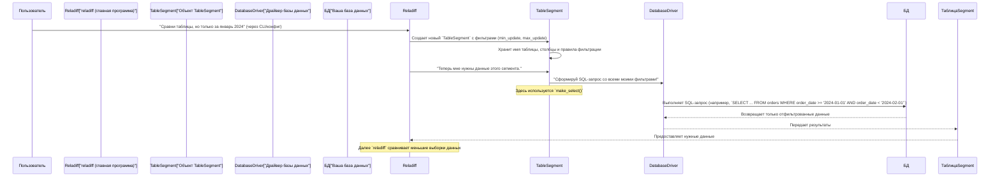

# Глава 4: Табличный сегмент

С возвращением, искатели приключений `reladiff`! В [Глава 3: Драйверы баз данных](03_database_drivers_.md) вы узнали, как `reladiff` подключается к различным базам данных с помощью специальных "транслейторов". Теперь, когда `reladiff` знает, *как* взаимодействовать с вашими базами данных, следующий вопрос: *какую* часть таблицы вы хотите сравнить?

Здесь вступает в силу концепция **Табличного сегмента**.

## Проблема: сравнить гигантскую книгу

Представьте, что у вас есть две одинаковые копии очень толстенной книги, но вы подозреваете, что некоторые страницы или даже несколько предложений могут отличаться. Вы бы читали обе книги от начала до конца, чтобы найти различия? Это заняло бы очень много времени!

Таблицы баз данных могут быть похожи на такие гигантские книги. Они могут содержать миллионы или даже миллиарды строк. Если бы `reladiff` всегда пытался сравнить *каждую строку* огромной таблицы, это было бы очень медленно и потребовало бы много ресурсов компьютера.

## Решение: умное окно (`TableSegment`)

`TableSegment` — это как **"умное окно"** или **"увеличительное стекло"**, которое `reladiff` может использовать, чтобы взглянуть на *конкретную часть* вашей таблицы. Вместо того чтобы читать всю книгу, `reladiff` может использовать `TableSegment`, чтобы сказать: "Сравни только строки заказов, сделанных в прошлом месяце," или "Посмотри на данные клиентов, у которых ID находятся в диапазоне от 1000 до 2000."

Это позволяет `reladiff`:
*   **Фокусироваться:** сосредоточить усилия на меньших, более релевантных кусках данных.
*   **Ускорять:** выполнять сравнения значительно быстрее, обрабатывая меньший объем данных.
*   **Экономить ресурсы:** использовать меньше памяти и процессора, особенно при очень больших таблицах.

## Что такое `TableSegment`?

В `reladiff` `TableSegment` — это особый объект Python, который представляет **определенную часть таблицы**. Он содержит все инструкции о *том*, какая часть таблицы вас интересует.

Вот основные данные, которые может содержать `TableSegment`:

*   **`database`**: подключение к базе данных. (Помните наши [Драйверы баз данных](03_database_drivers_.md)?) Это говорит сегменту, *где* находится таблица.
*   **`table_path`**: фактическое название таблицы, которой вы интересуетесь (например, `('public', 'orders')`).
*   **`key_columns`**: столбец(цы), которые уникально идентифицируют каждую строку. Это очень важно для `reladiff`, чтобы сопоставлять строки между таблицами. Представьте это как номер страницы книги для каждого предложения. Обычно используют столбец `id`.
*   **`update_column` (по желанию)**: столбец, который показывает, когда строка была последний раз изменена (например, `last_updated_at`). Полезно для сравнения изменений во времени.
*   **`extra_columns` (по желанию)**: любые другие столбцы, которые вы хотите проверить на различия, кроме ключевых.

### Фильтрация вашего окна

"Умная" часть `TableSegment` заключается в его возможностях фильтрации. Вы можете указать, какие данные он должен рассматривать:

*   **`min_key` и `max_key`**: позволяют задать диапазон для `key_columns`. Например, `min_key=1000, max_key=2000` для столбца `id` включит только строки, где `id` находится между 1000 и 1999.
*   **`min_update` и `max_update`**: подобно `min_key`/`max_key`, но для вашего `update_column`. Это отлично подходит для сравнения данных за определенный период, например, за "вчера".
*   **`where`**: мощный параметр, позволяющий добавить любой собственный SQL-условие `WHERE`. Например, `where="order_status = 'completed'"` включит только завершенные заказы.

## Создание вашего первого `TableSegment`

Самый простой способ создать `TableSegment` — использовать функцию `connect_to_table`, предоставляемую `reladiff`. Предположим, мы хотим сравнить данные заказов за январь 2024 года.

```python
from reladiff import connect_to_table
from datetime import datetime

# 1. Определим URI нашей базы данных (как в Глава 1 и 2)
#    Предположим локальную PostgreSQL базу
db_uri = "postgresql:///"
table_name = "orders"
key_col = "order_id"
update_col = "order_date"

# 2. Создадим `TableSegment` для заказов января 2024 (Таблица A)
jan_1_2024 = datetime(2024, 1, 1)
feb_1_2024 = datetime(2024, 2, 1)

table_segment_a = connect_to_table(
    db_uri,
    table_name,
    key_columns=key_col,
    update_column=update_col,
    min_update=jan_1_2024,
    max_update=feb_1_2024,
    extra_columns=["customer_id", "total_amount"]
)

print(f"Табличный сегмент A охватывает: {table_segment_a.table_path}")
print(f"  Ключевые столбцы: {table_segment_a.key_columns}")
print(f"  Диапазон обновлений: {table_segment_a.min_update} — {table_segment_a.max_update}")
```

**Что тут произошло?**

*   Мы импортировали `connect_to_table` и `datetime`.
*   Настроили базовые параметры подключения и название таблицы.
*   Вызвали `connect_to_table`. Эта функция внутри подключается к базе данных (используя правильный [Драйвер базы данных](03_database_drivers_.md)) и создает объект `TableSegment`.
*   Указали `key_columns`, `update_column`, а также задали `min_update` и `max_update` для определения "умного окна" на январь 2024.
*   Добавили `extra_columns`, которые хотим сравнить.

Теперь, если у нас есть другая таблица заказов в другой базе данных, например, Snowflake, мы можем создать второй `TableSegment` для того же периода и передать оба в функцию `diff_tables`:

```python
from reladiff import diff_tables
# ... (table_segment_a определен выше) ...

# Предположим, table_segment_b для этого же периода в Snowflake
# (детали опущены для краткости, но использовался бы URI snowflake://...)
# table_segment_b = connect_to_table("snowflake://...", table_name, ...)

# Для примера используем тот же сегмент для обеих таблиц (выведет отсутствие различий)
table_segment_b = table_segment_a.new()  # Создает точную копию

print("\nЗапуск сравнения таблиц...")
with diff_tables(table_segment_a, table_segment_b) as diff:
    for sign, row in diff:
        print(f"{sign} {row}")
    # Обычно вывод будет таким:
    # + ('order_123', 'cust_A', 150.0) — строка есть только в B или отличается
    # - ('order_456', 'cust_B', 200.0) — строка есть только в A или отличается
    print(diff.get_stats_string())
```

Это демонстрирует, как `TableSegment` служит строительными блоками для функций сравнения `reladiff` (`diff_tables`), которые используют их, чтобы понять, *что* именно сравнивать.

## Внутри: как `TableSegment` творит магию

Когда вы создаете `TableSegment` и просите `reladiff` сравнить его, `reladiff` не просто скачивает всю таблицу и фильтрует ее на вашем компьютере. Вместо этого `TableSegment` умно формирует SQL-запросы, которые выполняют фильтрацию *прямо в базе данных*. Это значительно эффективнее!

Вот упрощенная последовательность того, как `TableSegment` помогает `reladiff` запрашивать данные:



### Взгляд в код

Давайте посмотрим, как объект `TableSegment` (определен в `reladiff/table_segment.py`) помогает строить эти умные запросы.

`TableSegment` — это `@dataclass`, то есть простая структура для хранения данных:

```python
# Из reladiff/table_segment.py (упрощенно)
from typing import Tuple
from runtype import dataclass
from sqeleton.databases import Database, DbPath, DbTime
from .utils import Vector

@dataclass
class TableSegment:
    database: Database
    table_path: DbPath
    key_columns: Tuple[str, ...]
    update_column: str = None
    extra_columns: Tuple[str, ...] = ()

    min_key: Vector = None
    max_key: Vector = None
    min_update: DbTime = None
    max_update: DbTime = None
    where: str = None
    # ... другие атрибуты и методы ...
```

Здесь хранится вся информация, которую вы передаете (например, `database`, `table_path`, `min_update`).

Самый важный метод для построения фильтрованного запроса — `make_select`. Он объединяет все ваши фильтры в один SQL `WHERE`:

```python
# Из reladiff/table_segment.py (упрощенно)
from sqeleton.queries import table, this, Code, SKIP

@dataclass
class TableSegment:
    # ... (атрибуты как выше) ...

    def _make_key_range(self):
        # Преобразует min_key/max_key в условия SQL
        if self.min_key is not None:
            # Генерирует условие, например 'id >= 1000'
            pass
        if self.max_key is not None:
            # Генерирует условие, например 'id < 2000'
            pass
        # Возвращает список условий SQL

    def _make_update_range(self):
        # Аналогично для min_update/max_update
        if self.min_update is not None:
            # Условие по дате обновления
            pass
        if self.max_update is not None:
            # Условие по дате обновления
            pass
        # Возвращает список условий SQL

    def _where(self):
        # Возвращает пользовательский WHERE, если есть
        return f"({self.where})" if self.where else None

    def make_select(self):
        # Формирует итоговый SQL-запрос с фильтрами
        return self.source_table.where(
            *self._make_key_range(),
            *self._make_update_range(),
            Code(self._where()) if self.where else SKIP
        )
```

Когда `reladiff` нужно взять данные из сегмента, он вызывает `make_select()`, чтобы получить SQL-запрос, который затем передает драйверу базы данных (изученному в [Глава 3](03_database_drivers_.md)) для выполнения.

Например, при подсчете строк или вычислении контрольной суммы сегмента, он использует методы `count()` или `count_and_checksum()`:

```python
# Из reladiff/table_segment.py (упрощенно)
from sqeleton.queries import Count, Checksum

@dataclass
class TableSegment:
    # ...

    def count(self) -> int:
        return self.database.query(self.make_select().select(Count()), int)

    def count_and_checksum(self) -> Tuple[int, int]:
        q = self.make_select().select(Count(), Checksum(self._relevant_columns_repr))
        count, checksum = self.database.query(q, tuple)
        return count or 0, int(checksum) if count else None
```

Эти методы используют `make_select()`, чтобы применять `COUNT()` и `CHECKSUM()` только к данным внутри этого сегмента, что повышает эффективность.

Кроме того, `TableSegment` включает методы вроде `new_key_bounds` и `segment_by_checkpoints`. Они важны для продвинутых алгоритмов сравнения `reladiff` (например, [HashDiff](05_hashdiff_algorithm_.md)), которые могут автоматически разбивать большой сегмент на меньшие для еще более эффективного сравнения:

```python
# Из reladiff/table_segment.py (упрощенно)
@dataclass
class TableSegment:
    # ...

    def new_key_bounds(self, min_key: Vector, max_key: Vector) -> "TableSegment":
        """Создает копию сегмента с более узкими границами ключей."""
        return self.replace(min_key=min_key, max_key=max_key)

    def segment_by_checkpoints(self, checkpoints: List[List[DbKey]]) -> List["TableSegment"]:
        """Разбивает сегмент на меньшие части по контрольным точкам."""
        # Внутренне использует create_mesh_from_points
        return [self.new_key_bounds(min_key=s, max_key=e) for s, e in create_mesh_from_points(*checkpoints)]
```

Эта возможность создавать "под-окна" из более крупного "окна" позволяет `reladiff` справляться с огромными таблицами, разбивая их на управляемые куски.

## Итог

Теперь вы знаете о мощной концепции `TableSegment` в `reladiff`. Вы понимаете, что он выступает как "умное окно", фокусирующееся на конкретных частях вашей базы данных, значительно ускоряя сравнение и сокращая использование ресурсов. Вы научились создавать объекты `TableSegment` с помощью `connect_to_table` и узнали, как они объединяют всю необходимую информацию для целенаправленного сравнения. Также вы получили представление о том, как `TableSegment` умно строит SQL-запросы для фильтрации данных прямо в базе.

В следующей главе мы подробно рассмотрим [HashDiff Algorithm](05_hashdiff_algorithm_.md), один из основных методов сравнения в `reladiff`, и узнаем, как он использует эти `TableSegment`, чтобы эффективно находить различия.
