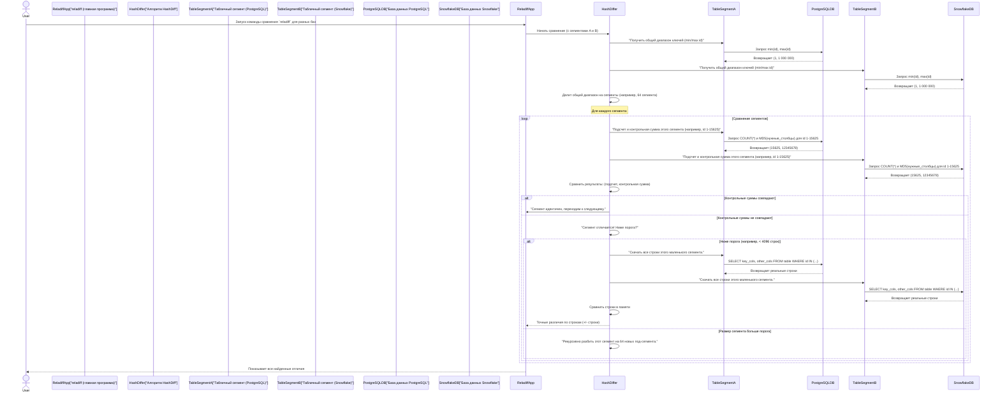

# Глава 5: Алгоритм HashDiff

С возвращением, искатели приключений `reladiff`! В [Глава 4: Табличный сегмент](04_table_segment_.md) вы узнали о "умном окне", которое использует `reladiff`, чтобы сосредоточиться на определённых частях ваших таблиц базы данных. Теперь, когда `reladiff` знает *что* искать в ваших таблицах, как он на самом деле *находит* отличия, особенно при сравнении таблиц из *разных* баз данных?

Здесь вступает в игру **алгоритм HashDiff**!

## Проблема: сравнение гигантских баз данных по всему миру

Представьте, что у вас есть огромная таблица базы данных в дата-центре в Нью-Йорке и её точная копия в облачной базе данных в Лондоне. Вам нужно быстро проверить, синхронизированы ли они, но вы подозреваете, что только несколько строк могут отличаться.

Если попытаться решить это, скачивая *все* данные из обеих таблиц на ваш компьютер и сравнивая их, это займет века, потребует огромных ресурсов сети и, скорее всего, приведет к сбою вашего компьютера из-за ограничений по памяти. Особенно это актуально для таблиц с миллионами или миллиардами строк!

## Решение: алгоритм HashDiff — ваш цифровой отпечаток-детектив

Алгоритм `HashDiff` в `reladiff` — это как суперэффективный "детектив по цифровым отпечаткам". Вместо того чтобы мучительно сравнивать каждую строку ваших огромных таблиц, он использует хитрую стратегию "разделяй и властвуй":

1.  **Цифровые отпечатки (контрольные суммы / хеши):** Он вычисляет уникальный "цифровой отпечаток" (называемый **контрольной суммой** или **хешем**) для небольших разделов обеих таблиц. Можно представить его как уникальный код для блока данных. Если даже один крошечный символ в этом блоке изменится, его отпечаток полностью изменится.
2.  **Разделяй и властвуй:**
    *   `reladiff` начинает с деления вашего большого `TableSegment` (помните, эти умные окна из [Глава 4: Табличный сегмент](04_table_segment_.md)?) на меньшие, равные по размеру части.
    *   Он просит каждую базу данных вычислить контрольную сумму для своего соответствующего участка.
    *   Если контрольные суммы для участка совпадают, `reladiff` знает, что вся эта часть *идентична* в обеих базах данных, и переходит к следующему! Нет необходимости скачивать данные из этой части.
    *   Если контрольные суммы *не* совпадают, `reladiff` понимает, что есть отличие в этом участке. Он рекурсивно делит *только этот различающийся участок* на ещё меньшие подчасти и повторяет сравнение контрольных сумм.
3.  **Точное обнаружение отличий:** Этот процесс продолжается, пока части не станут очень маленькими (ниже определенного "порога", который вы можете задать). Тогда `reladiff` скачивает немного строк из этих малых различающихся участков и сравнивает их локально на вашем компьютере, чтобы найти точные отличающиеся строки.

Этот подход невероятно эффективен для больших таблиц, особенно когда изменилось только небольшое число строк. Он минимизирует передачу данных, экономит ваше время, пропускную способность и вычислительные ресурсы.

## Как использовать HashDiff

Хорошая новость: для **межбазового сравнения** `reladiff` автоматически выбирает алгоритм `HashDiff`! Вам не нужно явно указывать `--algorithm hashdiff`, если только не хотите сделать это специально.

Однако у `HashDiff` есть два важных параметра, которые можно настроить:

*   **`--bisection-factor`**: сколько сегментов `reladiff` должен делить различающийся участок на каждом шаге.
*   **`--bisection-threshold`**: максимальное число строк в сегменте, которое `reladiff` разрешит перед тем, как остановить деление и скачать строки для локового сравнения.

Используем наш пример из [Глава 1: Интерфейс командной строки (CLI)](01_command_line_interface__cli__.md) и [Глава 2: Система конфигурации](02_configuration_system_.md): сравнение таблицы `events` в PostgreSQL с такой же в Snowflake.

```bash
reladiff \
  postgresql:/// \
  events \
  "snowflake://<имя_пользователя>:<пароль>@<хост>/<БАЗА_ДАННЫХ>/<СХЕМА>?warehouse=<СКЛАД>&role=<РОЛЬ>" \
  events \
  -k event_id \         # Ключевой столбец
  -c event_data \       # Столбец для сравнения
  -w "event_time < '2024-10-10'" \  # Фильтр
  --bisection-factor 64 \   # Делить на 64 под-сегмента на каждом шаге
  --bisection-threshold 4096 # Если сегмент содержит менее 4096 строк, скачивать и сравнивать локально
```

При запуске этого `reladiff` автоматически выберет `HashDiff`, потому что таблицы сравниваются из двух разных баз данных (PostgreSQL и Snowflake).

*   `--bisection-factor 64` означает, что если обнаружен большой различающийся сегмент, он будет разбит на 64 меньших сегмента для следующего раунда вычислений контрольных сумм. Более высокий коэффициент означает больше запросов, но потенциально быстрее сузит отличия.
*   `--bisection-threshold 4096` означает, что если `reladiff` обнаружит различающийся сегмент с 4096 строк или меньше, он не будет делить его дальше. Вместо этого он скачает все эти строки из обеих таблиц и сравнит их напрямую в памяти вашего компьютера. Это эффективно для небольших сегментов, когда накладные расходы дополнительных запросов превышают преимущества деления.

## Внутри: как работает детектив HashDiff

Давайте проследим, что происходит, когда `reladiff` запускает алгоритм `HashDiff`.



### Заглянем в код

Логика `HashDiffer` в основном находится в файле `reladiff/hashdiff_tables.py`. Он наследует от `TableDiffer` (в `reladiff/diff_tables.py`), который реализует общий каркас `_bisect_and_diff_tables` для деления сегментов.

Основная часть `HashDiff` — это его метод `_diff_segments`. Упростим и посмотрим на ключевые части:

```python
# Из reladiff/hashdiff_tables.py (упрощенно)

@dataclass(frozen=True)
class HashDiffer(TableDiffer):
    bisection_threshold: Number = DEFAULT_BISECTION_THRESHOLD
    bisection_factor: int = DEFAULT_BISECTION_FACTOR
    # ... другие атрибуты ...

    def _diff_segments(
        self,
        ti: ThreadedYielder, # Вспомогательный объект для потоков
        table1: TableSegment,
        table2: TableSegment,
        info_tree: InfoTree, # Для отслеживания прогресса сравнения
        max_rows: int,
        level=0,
        segment_index=None,
        segment_count=None,
    ):
        # 1. Получить количество строк и контрольные суммы сегмента из обеих таблиц
        #    table1.count_and_checksum() внутри формирует SQL-запрос
        #    типа: SELECT COUNT(*), MD5(CONCAT(col1, col2, ...)) FROM my_table WHERE ...
        (count1, checksum1), (count2, checksum2) = self._threaded_call("count_and_checksum", [table1, table2])

        # Обновить info_tree с данными по сегменту
        info_tree.info.rowcounts = {1: count1, 2: count2}

        # 2. Проверить, совпадают ли сегменты (контрольные суммы и количество строк)
        if checksum1 == checksum2 and count1 == count2:
            info_tree.info.is_diff = False # Обозначить, что сегмент одинаковый
            return # Отличий нет, завершаем!

        # 3. Если контрольные суммы (или количество строк) не совпадают, есть отличие!
        info_tree.info.is_diff = True

        # 4. Решить: делить дальше или скачать и сравнить локально?
        #    Если размер сегмента ниже порога или слишком мал для эффективного деления:
        if max_rows < self.bisection_threshold or max(table1.approximate_size(), table2.approximate_size()) < self.bisection_factor * 2:
            # Скачать строки и сравнить локально
            rows1, rows2 = self._threaded_call("get_values", [table1, table2])
            diff = list(diff_sets(rows1, rows2, self.skip_sort_results, self.duplicate_rows_support))

            info_tree.info.set_diff(diff) # Запомнить найденные различия
            info_tree.info.rowcounts = {1: len(rows1), 2: len(rows2)}

            logger.info(f"Обнаружено различий: {len(diff)} строк.")
            return diff # Вернуть точечные различия по строкам

        # 5. Если сегмент все еще большой, рекурсивно делим его
        return super()._bisect_and_diff_segments(ti, table1, table2, info_tree, level=level, max_rows=max(count1, count2))
```

Этот упрощенный пример показывает основную логику: `reladiff` сначала использует запросы `count_and_checksum` к `TableSegment` (функциональность, реализуемую через [Драйверы баз данных](03_database_drivers_.md) для вычисления MD5-хэшей). По результатам он либо завершает работу (если сегменты одинаковы), либо скачивает строки для локового сравнения (если сегменты малы), либо вызывает рекурсивное деление сегментов через свой родительский класс `TableDiffer`.

Функция `diff_sets`, также в `reladiff/hashdiff_tables.py`, реализует финальный локальный анализ после скачивания строк:

```python
# Из reladiff/hashdiff_tables.py (упрощенно)
from collections import Counter
from itertools import chain

def diff_sets(a: list, b: list, skip_sort_results: bool, duplicate_rows_support: bool) -> Iterator:
    """
    Сравнивает два списка строк (кортежей) и ищет различия.
    Каждая строка — кортеж значений соответствующих столбцов.
    """
    if duplicate_rows_support:
        # При поддержке дубликатов используем Counter для точного подсчета
        c = Counter(b)
        c.subtract(a)
        diff = (("+", k) if count > 0 else ("-", k) for k, count in c.items() for _ in range(abs(count)))
    else:
        # Без поддержки дубликатов — сравниваем множества
        sa = set(a)
        sb = set(b)
        diff = chain((("-", x) for x in sa - sb), (("+", x) for x in sb - sa))

    # Опционально сортируем для последовательного вывода
    return diff if skip_sort_results else sorted(diff, key=lambda i: i[1])
```
Эта функция получает скачанные строки (кортежи значений) и быстро определяет, какие строки есть в таблице A, но отсутствуют в B (`-`), и наоборот (`+`).

## Итог

Теперь вы знаете, как работает **алгоритм HashDiff** в `reladiff`. Он выступает как "детектив по цифровым отпечаткам", используя контрольные суммы и рекурсивную стратегию "разделяй и властвуй" для эффективного сравнения больших таблиц из разных баз данных, минимизируя передачу данных и быстро выявляя точные различия. Также вы научились настраивать его параметры через `--bisection-factor` и `--bisection-threshold`.

Этот алгоритм идеально подходит для высокопроизводительного сравнения баз данных, если таблицы в основном похожи, и требуется выявить тонкие расхождения.

В следующей главе мы рассмотрим алгоритм [JoinDiff](06_joindiff_algorithm_.md), который `reladiff` использует для сравнения *внутри одной базы данных* и обладает иными возможностями.
