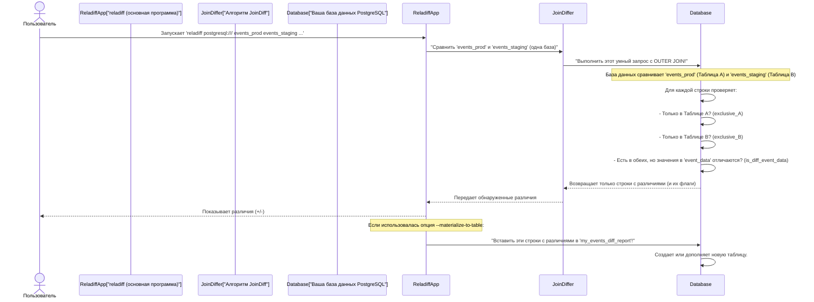

# Глава 6: Алгоритм JoinDiff

С возвращением, приключенцы `reladiff`! В [Глава 5: Алгоритм HashDiff](05_hashdiff_algorithm_.md) вы узнали о мощном «детективе цифровых отпечатков» `reladiff` для сравнения таблиц, находящихся в *разных* базах данных. HashDiff отлично подходит для минимизации передачи данных по сети.

Но что если две таблицы, которые нужно сравнить, находятся *в одном месте*, то есть в **одной базе данных**? Всё равно отправлять маленькие контрольные суммы туда и обратно или скачивать части данных на компьютер для сравнения? Это было бы как пытаться сравнить две таблицы Excel на рабочем столе, отправляя их по электронной почте себе через весь мир и обратно! Такой подход неэффективен для локальной задачи.

Вот тут на помощь приходит `reladiff` с **алгоритмом JoinDiff**!

## Проблема: сравнение таблиц на одном сервере

Представьте, что у вас есть две таблицы с названиями `events_prod` и `events_staging`, которые находятся в *одной* базе данных PostgreSQL. Вы только что выпустили новую функцию и хотите быстро проверить, содержит ли таблица `events_staging` те же данные, что и `events_prod`, или есть новые, пропущенные или изменённые события.

Можно попробовать скачать все данные обеих таблиц в ваше приложение и написать код для их сравнения. Но для больших таблиц это будет медленно, потребует много памяти и может даже привести к сбою приложения. Самые базы данных уже оптимизированы для обработки больших объёмов данных и выполнения сравнений. Тогда возникает вопрос: как дать базе данных выполнить всю тяжелую работу напрямую?

## Решение: алгоритм JoinDiff – встроенный в вашу базу данных сопоставитель

Алгоритм `JoinDiff` от `reladiff` специально разработан для сравнения таблиц **внутри одной базы данных**. Вместо того чтобы полагаться на передачу данных по сети и внешние вычисления, `JoinDiff` умно использует мощные возможности SQL самой базы данных, особенно операции `OUTER JOIN`.

Представьте так: `JoinDiff` дает базе данных конкретную инструкцию: «Объедини эти две таблицы и скажи мне для каждой строки, есть ли она только в Таблице A, только в Таблице B или в обеих, но с разными значениями в нужных мне колонках». База данных выполняет это сложное сравнение очень быстро, прямо на своем сервере.

Вот почему `JoinDiff` так эффективен для сравнения таблиц в одной базе данных:

*   **Оптимизирован для скорости**: сама система базы данных создана для эффективных операций с данными. Используя `OUTER JOIN`, сравнение происходит там, где данные хранятся, исключая задержки сети и накладные расходы по передаче данных.
*   **Эффективность ресурсов**: вашему приложению `reladiff` нужно получать только *различия*, а не весь объем данных обеих таблиц. Это экономит память и вычислительные ресурсы вашего компьютера.
*   **Создание таблицы с различиями**: уникальная особенность `JoinDiff` — возможность напрямую создавать *новую таблицу* в базе данных, содержащую все обнаруженные различия. Это очень удобно для аудита, отчетности или дальнейшего анализа.

## Как использовать JoinDiff

Отличная новость: `reladiff` умеет всё сам! Если вы скажете ему сравнить две таблицы в **одной базе данных**, он **автоматически выберет алгоритм JoinDiff**. Обычно указывать его вручную не нужно.

Тем не менее, можно явно указать `reladiff` использовать `JoinDiff`, задав опцию `--algorithm`:

```bash
reladiff \
  postgresql:/// \
  events_prod \
  events_staging \
  -k event_id \          # ключевой столбец для уникальной идентификации строк
  -c event_data \        # столбец для проверки на различия
  --algorithm joindiff   # явно выбрать JoinDiff (необязательно для сравнения в одной базе)
```

При запуске этой команды `reladiff` подключится к вашей базе PostgreSQL, скажет ей сравнить `events_prod` и `events_staging` с помощью `OUTER JOIN`, и покажет вам любые различия (строки, присутствующие только в `events_prod` или только в `events_staging`, или строки с совпадающим `event_id`, но разными `event_data`).

### Создание таблицы с различиями

Одна из самых мощных функций `JoinDiff` — `materialize-to-table`. Эта опция говорит `reladiff` создать новую таблицу в базе данных, содержащую строки с различиями.

Пример:

```bash
reladiff \
  postgresql:/// \
  events_prod \
  events_staging \
  -k event_id \
  -c event_data \
  --materialize-to-table my_events_diff_report \
  -w "event_time < '2024-10-10'" # сравнить только старые события
```

После выполнения, если найдены различия, будет создана новая таблица с названием `my_events_diff_report` **прямо в вашей базе PostgreSQL**. Эта таблица будет содержать все отличающиеся строки, а также специальные колонки, показывающие, была ли строка только в `events_prod`, только в `events_staging`, или если какие-то поля имели разные значения. Такой отчет очень полезен для долгосрочного анализа или совместного использования результатов без повторного запуска `reladiff`.

Также можно использовать `--materialize-all-rows` вместе с `--materialize-to-table`, чтобы в новую таблицу попали *все* строки сравнения (не только отличающиеся), чтобы увидеть, какие строки совпали полностью.

Еще одна полезная опция — `--assume-unique-key`. По умолчанию `JoinDiff` проверяет, что ваши `key-колонки` действительно уникальны. Это важная проверка, но для очень больших таблиц без ограничений `UNIQUE` она может быть медленной. Если вы абсолютно уверены, что ключи уникальны, можно указать `--assume-unique-key`, чтобы пропустить эту проверку и ускорить процесс.

## Как работает JoinDiff под капотом

Итак, как `reladiff` использует `OUTER JOIN` для поиска различий? Вот упрощенное описание:



Идея в том, что `reladiff` строит очень конкретный SQL-запрос с использованием `OUTER JOIN`, который просит базу данных сравнить две таблицы по их `key-колонкам`. Для каждой строки запрос создает специальные «флаги»:

*   **`is_exclusive_a`**: Истина, если ключ строки есть только в `events_prod` (Таблица A).
*   **`is_exclusive_b`**: Истина, если ключ есть только в `events_staging` (Таблица B).
*   **`is_diff_<имя_столбца>`**: Истина, если ключ есть в обеих таблицах, но значение `<имя_столбца>` отличается.

Затем `reladiff` говорит базе данных возвращать только строки, у которых хотя бы один из этих флагов равен Истина. Это означает, что ваше приложение `reladiff` получает только реальные отличия, что очень эффективно. Если вы выбрали `materialize_to_table`, `reladiff` просто просит базу данных вставить эти отфильтрованные результаты в новую таблицу.

### Заглянем в код

Класс `JoinDiffer`, реализующий алгоритм JoinDiff, находится в `reladiff/joindiff_tables.py`. Он наследует от `TableDiffer` (как `HashDiffer`), предоставляя общие функции сравнения.

Вот упрощенный пример определения `JoinDiffer`:

```python
# Из reladiff/joindiff_tables.py (упрощенно)
from runtype import dataclass
from .diff_tables import TableDiffer
from sqeleton.databases import DbPath

@dataclass
class JoinDiffer(TableDiffer):
    validate_unique_key: bool = True
    sample_exclusive_rows: bool = False
    materialize_to_table: DbPath = None
    materialize_all_rows: bool = False
    table_write_limit: int = 1000  # Максимум строк для записи за поток
    # ... другие внутренние параметры ...
```
Это показывает, что `JoinDiffer` — специализация `TableDiffer` (базового класса для всех алгоритмов сравнения), и содержит настройки для таких функций, как материализация и проверка ключей.

Самое важное — создание SQL-запроса с `OUTER JOIN` происходит в методе вроде `_create_outer_join` (упрощенно):

```python
# Из reladiff/joindiff_tables.py (упрощенно)
from sqeleton.queries import outerjoin, this, or_
from sqeleton.queries.extras import NormalizeAsString

def _create_outer_join(table1_segment, table2_segment):
    # Представление таблиц как выбираемых выражений
    a = table1_segment.make_select()
    b = table2_segment.make_select()

    # Получение ключевых колонок для соединения
    keys1 = table1_segment.key_columns
    keys2 = table2_segment.key_columns
    on_conditions = [a[k1] == b[k2] for k1, k2 in zip(keys1, keys2)]

    # Определение сравниваемых колонок
    cols_to_compare1 = table1_segment.relevant_columns
    cols_to_compare2 = table2_segment.relevant_columns

    # Создание флагов для сравнения по колонкам
    # `is_distinct_from` правильно обрабатывает NULL
    is_diff_cols = {
        f"is_diff_{c1}": a[c1].is_distinct_from(b[c2])
        for c1, c2 in zip(cols_to_compare1, cols_to_compare2)
    }

    # Выбор всех релевантных колонок с нормализацией значений
    a_cols = {f"{c}_a": NormalizeAsString(a[c]) for c in cols_to_compare1}
    b_cols = {f"{c}_b": NormalizeAsString(b[c]) for c in cols_to_compare2}

    # Построение итогового запроса с OUTER JOIN
    outer_join_query = outerjoin(a, b).on(*on_conditions).select(
        is_exclusive_a=and_(b[k] == None for k in keys2),  # Только в A (ключ B равен NULL)
        is_exclusive_b=and_(a[k] == None for k in keys1),  # Только в B (ключ A равен NULL)
        **is_diff_cols,  # Флаги для различий по колонкам
        **a_cols,        # Значения из таблицы A
        **b_cols         # Значения из таблицы B
    ).where(
        or_(this.is_exclusive_a, this.is_exclusive_b, *this[is_diff_cols.keys()])
    )
    return outer_join_query
```
Этот упрощенный пример показывает, как `reladiff` создает SQL-запрос с `OUTER JOIN`, выбирающий исходные значения колонок и специальные флаги (`is_exclusive_a`, `is_exclusive_b`, `is_diff_<колонка>`), указывающие, где есть различия. Такой мощный запрос отправляется в базу данных.

Метод `_diff_segments` затем выполняет этот запрос, получает ответ и преобразует данные в стандартный формат `reladiff` — `+` или `-`:

```python
# Из reladiff/joindiff_tables.py (упрощенно)
def _diff_segments(self, ti, table1, table2, info_tree, max_rows, *args):
    # Проверка, что таблицы в одной базе
    assert table1.database is table2.database

    # Создание специализированного запроса с OUTER JOIN
    diff_rows_query = self._create_outer_join(table1, table2)

    # Опционально: запуск фоновых задач, например, материализация различий
    if self.materialize_to_table:
        self._materialize_diff(table1.database, diff_rows_query)

    logger.debug("Запрос на получение разных строк из базы данных...")
    # Выполнение запроса и получение результатов
    diff_results_from_db = table1.database.query(diff_rows_query, list)
    info_tree.info.set_diff(diff_results_from_db)

    # Обработка каждой строки результата
    for is_exclusive_a, is_exclusive_b, *values_and_diff_flags in diff_results_from_db:
        # Извлечение исходных значений колонок
        a_row, b_row = parse_db_output(values_and_diff_flags)

        if not is_exclusive_b:  # Если строка не только в B (в A или обновлена)
            yield "-", tuple(a_row)  # Удаление или обновление из A
        if not is_exclusive_a:  # Если строка не только в A (в B или обновлена)
            yield "+", tuple(b_row)  # Добавление или обновление в B
```
Этот метод — центральный исполнитель. Он использует `_create_outer_join` для формирования SQL-запроса, выполняет его через драйвер базы данных (см. [Глава 3: Драйверы баз данных](03_database_drivers_.md)), и обрабатывает полученные данные, выдавая привычный вывод `reladiff`.

Наконец, метод `_materialize_diff` занимается записью результатов в новую таблицу:

```python
# Из reladiff/joindiff_tables.py (упрощенно)
from .query_utils import append_to_table

def _materialize_diff(self, db_connection, rows_to_materialize_query):
    # Передает результат в базу данных для вставки в указанную таблицу
    append_to_table(db_connection, self.materialize_to_table,
                    rows_to_materialize_query.limit(self.table_write_limit))
```
Этот пример показывает, как `reladiff` просто передает запрос с результатами в базу, которая сама вставляет их в таблицу, минуя передачу данных на клиентскую сторону.

## JoinDiff против HashDiff: краткое сравнение

Вот таблица с основными отличиями двух алгоритмов, используемых `reladiff`:

| Особенность           | Алгоритм HashDiff ([Глава 5](05_hashdiff_algorithm_.md)) | Алгоритм JoinDiff                                |
|-----------------------|---------------------------------------------------------|--------------------------------------------------|
| **Основное назначение** | Сравнение таблиц в **разных** базах данных             | Сравнение таблиц **внутри одной** базы данных   |
| **Основной метод**     | Рекурсивное создание хеш-сумм и локальное сравнение      | SQL `OUTER JOIN`, выполняемый в базе данных      |
| **Передача данных**     | Только маленькие контрольные суммы и финальные отличия по сети | Возможна большая выборка с `OUTER JOIN`, но остается внутри базы данных, если не выводится наружу |
| **Производительность**  | Оптимизировано для минимизации сетевого трафика        | Оптимизировано для обработки прямо в базе данных |
| **Ключевые возможности** | Обработка задержек сети и разных типов баз данных     | Может материализовать результаты прямо в новую таблицу |
| **Автоматический выбор?** | Да, для сравнения в разных базах данных                | Да, для сравнения в одной базе данных          |

## Итоги

Теперь вы понимаете, как работает `JoinDiff`, предназначенный для эффективного сравнения таблиц **внутри одной базы** данных. Вы узнали, как он использует мощь SQL с `OUTER JOIN`, минимизируя передачу данных и предоставляя такие функции, как создание таблиц с различиями для дальнейшего анализа. Также вы знаете, когда лучше использовать `JoinDiff`, а когда — `HashDiff`.

В следующей главе мы сосредоточимся на выводе результатов этих алгоритмов. Вы узнаете, как `reladiff` представляет свои выводы через [Результат сравнения и дерево информации](07_diff_result___info_tree__.md), получая всестороннюю картину ваших сравнений данных.
