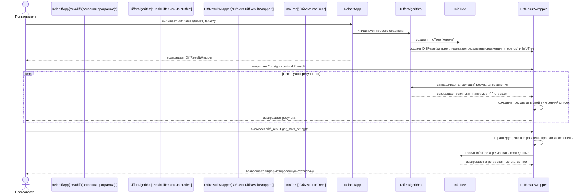
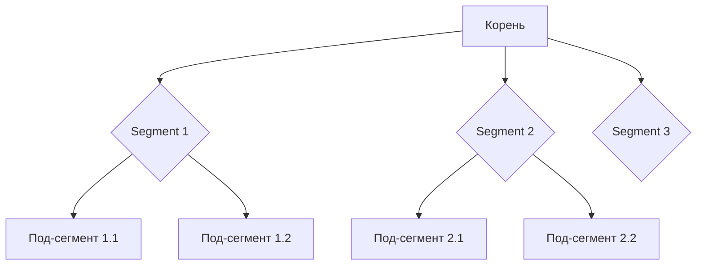

# Глава 7: Результаты сравнения и дерево информации

С возвращением, искатели приключений `reladiff`! В [Глава 5: Алгоритм HashDiff](05_hashdiff_algorithm_.md) и [Глава 6: Алгоритм JoinDiff](06_joindiff_algorithm_.md) вы узнали о мощных алгоритмах, которые использует `reladiff` для поиска различий между вашими таблицами. Теперь вам ясно *как* `reladiff` выполняет эти сравнения, будь то между разными базами данных или внутри одной.

Но после того, как `reladiff` проделает всю свою тяжелую работу, как он сообщает вам о найденном? Как увидеть сами различия? И как получить сводку сравнения, например, сколько строк отличается или насколько изменились ваши данные?

Здесь на помощь приходят концепции **Результаты сравнения и дерево информации**. Они показывают, как `reladiff` представляет результат сравнения и помогают понять его прогресс и итоговую сводку.

## Проблема: понимание результатов сравнения

Представьте, что вы попросили `reladiff` сравнить две огромные таблицы, каждая с миллионами строк. Он успешно работает, но что вы ожидаете увидеть?

1.  **Фактические различия:** необходимо увидеть, какие конкретные строки были добавлены (`+`), удалены (`-`) или изменены (`!`).
2.  **Сводка:** вы хотите знать, например:
    *   сколько всего строк в каждой таблице?
    *   сколько строк уникально первой таблице?
    *   сколько строк уникально второй таблице?
    *   сколько строк обновлено (есть в обеих, но с разными значениями)?
    *   каков общий "процент различий" между таблицами?
3.  **Внутренние сведения (для сложных случаев):** при очень глубоких или долгих сравнениях вам может захотеться спросить: "Он все еще работает? Какой прогресс? Какие части таблиц занимают больше всего времени на сравнение?"

Система **Результаты сравнения и дерево информации** дает все эти ответы!

## Основные концепции: `DiffResultWrapper` и `InfoTree`

`reladiff` использует два основных компонента для формирования полной картины вашего сравнения:

1.  **`DiffResultWrapper` (ваша ведомость результатов сравнения):**
    *   Это главный объект, который `reladiff` возвращает при запуске сравнения.
    *   Он как ваш полный **"Отчет о сравнении"**. Он позволяет вам:
        *   **Просматривать отдельные различия:** можно проходить по нему в цикле, получая пары вроде `('-', данные_строки)` для строк, удаленных из первой таблицы, или `('+', данные_строки)` для добавленных во вторую.
        *   **Получать сводную статистику:** предоставляет богатую статистику по всему сравнению — общее число строк, количество добавленных, удаленных или обновленных строк, а также рассчитанный "процент различий".
    *   Он разработан так, чтобы быть эффективным: показывает различия по мере их обнаружения, но также сохраняет их, чтобы позже можно было просмотреть без повторного выполнения сравнения.

2.  **`InfoTree` (ваш отчет о прогрессе сравнения):**
    *   Это внутренний **"Отчет о прогрессе"**, который `reladiff` строит во время процесса сравнения.
    *   Помните, как `reladiff` разбивает большие таблицы на меньшие [Segment таблицы](04_table_segment_.md) (особенно с помощью [HashDiff Algorithm](05_hashdiff_algorithm_.md))? `InfoTree` отслеживает прогресс и метрики для *каждого* из этих сегментов.
    *   Он собирает счетчики, контрольные суммы и информацию о наличии различий в каждом сегменте.
    *   Важное — он **агрегирует** эту информацию. Это значит, что он собирает данные со всех маленьких сегментов, чтобы дать вам сводку для больших сегментов и, в конечном итоге, для всего сравнения. Эта агрегация обеспечивает статистику, которую вы видите в `DiffResultWrapper`.

## Как использовать `DiffResultWrapper` для получения результатов

Рассмотрим, как использовать API `reladiff` на Python для выполнения сравнения и последующего анализа объекта `DiffResultWrapper`, который он возвращает. Возьмем пример сравнения двух таблиц `users_v1` и `users_v2` в локальной базе PostgreSQL.

Для начала создайте некоторые фиктивные таблицы (эти команды можно выполнить в клиенте PostgreSQL, например `psql`):

```sql
CREATE TABLE users_v1 (id INT PRIMARY KEY, name TEXT, email TEXT);
CREATE TABLE users_v2 (id INT PRIMARY KEY, name TEXT, email TEXT);

INSERT INTO users_v1 VALUES (1, 'Alice', 'alice@example.com');
INSERT INTO users_v1 VALUES (2, 'Bob', 'bob@example.com');
INSERT INTO users_v1 VALUES (3, 'Charlie', 'charlie@example.com');

INSERT INTO users_v2 VALUES (1, 'Alice', 'alice@example.com'); -- то же, что и v1
INSERT INTO users_v2 VALUES (2, 'Robert', 'robert@example.com'); -- обновление Боба
INSERT INTO users_v2 VALUES (4, 'David', 'david@example.com'); -- добавление Дэвида
-- Charlie (id=3) из v1 отсутствует в v2
```

Теперь напишите скрипт на Python для сравнения:

```python
from reladiff import connect_to_table, diff_tables

# 1. Подключение к таблицам (как в главе 4)
table1 = connect_to_table("postgresql:///", "users_v1", "id", extra_columns=["name", "email"])
table2 = connect_to_table("postgresql:///", "users_v2", "id", extra_columns=["name", "email"])

# 2. Выполнение сравнения!
# Функция 'diff_tables' возвращает объект DiffResultWrapper
with diff_tables(table1, table2) as diff_result:
    # 3. Просматриваем индивидуальные различия
    print("--- Индивидуальные различия ---")
    for sign, row_values in diff_result:
        # '+' — строка в таблице2, не в таблице1 или новая версия
        # '-' — строка в таблице1, не в таблице2 или устаревшая
        print(f"{sign} {row_values}")

    # 4. Получение сводки статистики
    print("\n--- Статистика (строка) ---")
    print(diff_result.get_stats_string())

    print("\n--- Статистика (словарь) ---")
    print(diff_result.get_stats_dict())

# Использование конструкции 'with' гарантирует корректное закрытие ресурсов.
```

**Ожидаемый вывод (упрощенно):**

```
--- Индивидуальные различия ---
- (2, 'Bob', 'bob@example.com')
- (3, 'Charlie', 'charlie@example.com')
+ (2, 'Robert', 'robert@example.com')
+ (4, 'David', 'david@example.com')

--- Статистика (строка) ---
3 строки в таблице A
3 строки в таблице B
2 строки уникальны только в таблице A (отсутствуют в B)
2 строки уникальны только в таблице B (отсутствуют в A)
1 строка обновлена
3 строки без изменений
66.67% уровень различий

--- Статистика (словарь) ---
{'rows_A': 3, 'rows_B': 3, 'exclusive_A': 2, 'exclusive_B': 2, 'updated': 1, 'unchanged': 3, 'total': 5, 'stats': {}}
```

**Объяснение:**

*   `diff_tables(table1, table2)` возвращает объект `DiffResultWrapper`, назовем его `diff_result`.
*   Внутри используется `with`, что обеспечивает закрытие ресурсов после завершения.
*   Цикл `for sign, row_values in diff_result:` дает вам по порядку обнаруженные различия:
    *   `('-', (2, 'Bob', 'bob@example.com'))` — строка с ID 2, которая была в `users_v1`, но изменена в `users_v2`.
    *   `('-', (3, 'Charlie', 'charlie@example.com'))` — строка с ID 3, которая изначально есть в `users_v1`, но отсутствует в `users_v2`.
    *   `('+', (2, 'Robert', 'robert@example.com'))` — новая версия строки с ID 2, обнаруженная в `users_v2`.
    *   `('+', (4, 'David', 'david@example.com'))` — добавленная в `users_v2` строка.
*   `diff_result.get_stats_string()` возвращает удобную для чтения сводку.
*   `diff_result.get_stats_dict()` — та же статистика в виде словаря, полезная для дальнейшей обработки или сохранения.

Обратите внимание, что в статистике отображается "1 строка обновлена": `reladiff` умно распознает, что наличие строки с `-` и `+` для одинакового ключа — это обновление. Также он правильно определил удаление Charlie и добавление David.

## Внутри: как собираются результаты и статистика

Давайте посмотрим, как `reladiff` обеспечивает получение как детальных различий, так и агрегированных данных.

### Роль `DiffResultWrapper`

При вызове `diff_tables` выбранный алгоритм сравнения ([HashDiff](05_hashdiff_algorithm_.md) или [JoinDiff](06_joindiff_algorithm_.md)) выполняет фактическое сравнение. Обнаружив различия, он "выдает" их обратно. `DiffResultWrapper` оборачивает этот процесс выдачи.



Как видно, `DiffResultWrapper` — центральный узел. Он собирает отдельные различия по мере их поступления (чтобы можно было проходить по ним несколько раз без повторного сравнения) и использует `InfoTree` для подсчета общей статистики.

Рассмотрим упрощенную версию `DiffResultWrapper` из `reladiff/diff_tables.py`:

```python
# Из reladiff/diff_tables.py (упрощенно)
from typing import Iterator, Tuple
from runtype import dataclass
from .info_tree import InfoTree

@dataclass
class DiffResultWrapper:
    diff: Iterator[Tuple[str, tuple]] # Реальные результаты сравнения (ленивый итератор)
    info_tree: InfoTree               # Дерево прогресса
    stats: dict
    _ti: object # Внутренний менеджер потоков
    result_list: list = None # Хранит результаты после первого прохода

    def __iter__(self):
        """Итерация по результатам сравнения (ленивый список)."""
        if self.result_list is None:
            self.result_list = []
        yield from self.result_list # сначала выдаем уже сохраненные
        for i in self.diff:         # потом — продолжаем из оригинального итератора
            self.result_list.append(i) # сохраняем для будущих вызовов
            yield i

    def _get_stats(self):
        # Обеспечивает сбор всех различий и их статистики
        list(self) # гарантирует, что все результаты прошли
        self.info_tree.aggregate_info() # собирает статистику из дерева

        # далее идет расчет статистики по результатам и info_tree.info
        diff_by_sign = {"+": 0, "-": 0, "!": 0}
        for sign, values in self.result_list:
            key = values[:len(self.info_tree.info.tables[0].key_columns)]
            # логика подсчета +, -, ! (обновлений)
            if sign == '+': diff_by_sign['+'] += 1
            elif sign == '-': diff_by_sign['-'] += 1
            # '!' определяется по совпадению "-" и "+" для одного ключа

        table1_count = self.info_tree.info.rowcounts[1]
        table2_count = self.info_tree.info.rowcounts[2]
        # ... остальные подсчеты статистики ...

        return "ваша статистика" # Возвращает объект статистики

    def get_stats_string(self):
        """Возвращает красиво отформатированную строку статистики"""
        diff_stats = self._get_stats()
        # форматирует статистику в строку
        return "Отформатированная строка"

    def get_stats_dict(self):
        """Возвращает словарь статистики"""
        diff_stats = self._get_stats()
        # преобразует в словарь
        return {"rows_A": diff_stats.table1_count, ...}

    def close(self):
        """Прерывает сравнение и закрывает пул потоков"""
        self._ti.shutdown(wait=False)

    # Методы для контекстного менеджера
    def __enter__(self): return self
    def __exit__(self, *args): self.close()
```

Ключевой — метод `__iter__`: он обеспечивает ленивый список результатов. Он сначала возвращает уже сохранённые, затем продолжает получать новые из `self.diff`, сохраняя их. Метод `_get_stats()` вызывается при запросе статистики: он убеждается, что все результаты прошли и затем запрашивает агрегированные данные у `InfoTree`.

### Роль `InfoTree`

`InfoTree` (определен в `reladiff/info_tree.py`) — это по сути древовидная структура, где каждый узел представляет [Segment таблицы](04_table_segment_.md) (или его под-сегмент), который `reladiff` сравнивает.



Каждый узел `InfoTree` содержит объект `SegmentInfo`, где хранится информация для *этого конкретного сегмента*: число строк, наличие различий и количество обнаруженных различий.

Во время сравнения (особенно с `HashDiff`) при разбитии на меньшие сегменты `reladiff` добавляет новые дочерние узлы. После завершения сравнения всех дочерних сегментов вызывается `aggregate_info()`, которая рекурсивно объединяет статистику из детей в родительский узел, и так до корня. В итоге, `SegmentInfo` корневого узла содержит финальную статистику всей разницы, которую использует `DiffResultWrapper`.

Общий вид `SegmentInfo` и `InfoTree`:

```python
# Из reladiff/info_tree.py (упрощенно)
from typing import List, Dict, Union
from runtype import dataclass
from .table_segment import TableSegment, EmptyTableSegment

@dataclass(frozen=False)
class SegmentInfo:
    tables: List[Union[TableSegment, EmptyTableSegment]] # сравниваемые сегменты

    diff: list = None      # Хранит реальные диффы этого сегмента
    is_diff: bool = None   # Есть ли различия в этом сегменте
    diff_count: int = None # Количество различий

    rowcounts: Dict[int, int] = {} # {1: число строк в таблице1, 2: число строк в таблице2}
    max_rows: int = None

    def set_diff(self, diff: list):
        """Заполняется, если найдены диффы в листовом сегменте."""
        self.diff = diff
        self.diff_count = len(diff)
        self.is_diff = self.diff_count > 0

    def update_from_children(self, child_infos):
        """Обновление из дочерних элементов"""
        self.diff_count = sum(c.diff_count for c in child_infos if c.diff_count is not None)
        self.is_diff = any(c.is_diff for c in child_infos)
        self.rowcounts = {
            1: sum(c.rowcounts[1] for c in child_infos if c.rowcounts),
            2: sum(c.rowcounts[2] for c in child_infos if c.rowcounts),
        }

@dataclass
class InfoTree:
    info: SegmentInfo # информация для этого узла
    children: List["InfoTree"] = None # дочерние узлы

    def add_node(self, table1: TableSegment, table2: TableSegment, max_rows: int = None):
        """Добавляет дочерний узел для под-сегмента."""
        node = InfoTree(SegmentInfo([table1, table2], max_rows=max_rows))
        if self.children is None:
            self.children = []
        self.children.append(node)
        return node

    def aggregate_info(self):
        """Рекурсивно собирает статистику из дочерних узлов."""
        if self.children:
            for c in self.children:
                c.aggregate_info()
            self.info.update_from_children([c.info for c in self.children])
```

Так `SegmentInfo` хранит данные по одному сегменту, а `InfoTree` — рекурсивная структура, которая собирает и обобщает показатели по всем сегментам, создавая полную картину сравнения.

## Итог

Теперь вы понимаете, как `reladiff` показывает результаты через систему **Результат сравнения и дерево информации**. `DiffResultWrapper` — ваш главный интерфейс для получения детальных строковых различий и общей статистики сравнения. Также вы узнали о `InfoTree` — внутренней механике, которая аккуратно отслеживает и агрегирует метрики со всех сегментов таблиц, обеспечивая богатую статистику.

Это завершает наш обзор основных компонентов `reladiff`. Вы прошли путь от командной строки (CLI) и системы конфигураций, через работу с драйверами баз данных и сегментами таблиц, до использования алгоритмов HashDiff и JoinDiff и презентации результатов.

Теперь у вас есть глубокое понимание работы `reladiff` и умение интерпретировать его мощные результаты!
