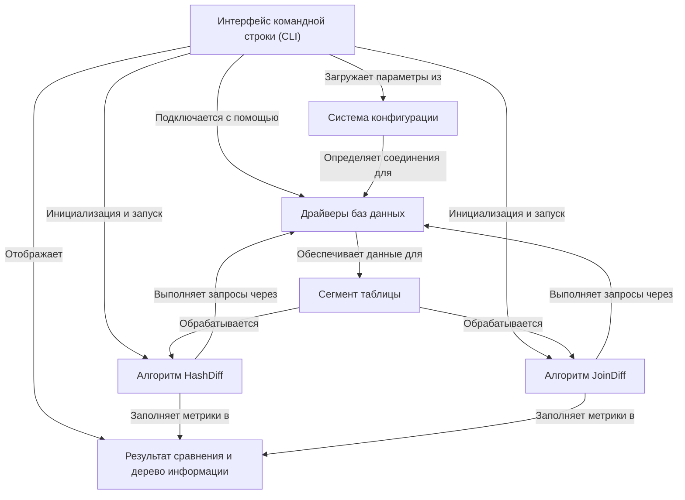

# Учебник: reladiff

Reladiff — это высокопроизводительный инструмент для **сравнения больших наборов данных** в *разных* или *одинаковых* базах данных. Он достигает этого, умно определяя изменения, либо с помощью **контрольных сумм** для кросс-баз данных, либо с помощью **SQL соединений** для операций внутри базы данных, минимизируя передачу данных и предоставляя подробные результаты сравнения.

## Визуальный обзор

## Главы

1. [Интерфейс командной строки (CLI)
](01_command_line_interface__cli__.md)
2. [Система конфигурации
](02_configuration_system_.md)
3. [Драйверы баз данных
](03_database_drivers_.md)
4. [Сегмент таблицы
](04_table_segment_.md)
5. [Алгоритм HashDiff
](05_hashdiff_algorithm_.md)
6. [Алгоритм JoinDiff
](06_joindiff_algorithm_.md)
7. [Результат сравнения и дерево информации
](07_diff_result___info_tree_.md)
